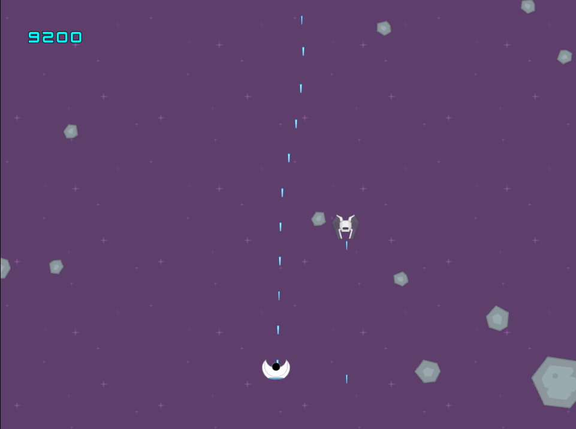

# Space Project

I started writing this game for fun when I was back in school in 2015. I have recently found the source files lost somewhere in an old HDD.

The objective is to finish this game for practicing/academic purposes. A demo of the game can be downloaded from https://github.com/GhostFinn/SpaceProject/releases

## Built With

* [SFML](https://www.sfml-dev.org/) - Framework used to write the game
* [JsonCPP](https://github.com/open-source-parsers/jsoncpp) - JSON reader; Required to load sprites

## Features

* Real physics-based collision between every object
* Physics based player movement. You are in Space; You won't have gravity to will help you reduce your velocity!! So if you do not try to stop your ship by moving it to the opposite direction you will continue moving indefinitely :) 
* Type-object feature; anyone can change the gameplay design by editing the ObjectData.json file in /Assets/ (ie. Player and Asteroids Max HP, Sprite settings, Object Weight, Object max speed, etc.)
* No engine was used to create this game, everything was written from scratch with the help of the SFML library.

## Author

* **Felipe Anargyrou** - [FAnargyrou](https://github.com/FAnargyrou)

## Acknowledgments

* Big thanks to my Physics teacher Paulo, I have lost contact with him when I left school but he was and still is a great inspiration to me. He helped me figure out some of the mechanics for the game all those years ago.

